# 内部处理逻辑文档 (Processing Logic)

本文档详细描述了 Fitness 后端各模块的内部处理流程、核心算法和横切关注点（AOP）。  
适用于后端开发理解业务逻辑、排查问题以及后续功能扩展的参考。

---

## 目录

1. [用户认证模块 (`fitness-user`)](#1-用户认证模块-fitness-user)
2. [内容库模块 (`fitness-content`)](#2-内容库模块-fitness-content)
3. [AI 评分模块 (`fitness-ai`)](#3-ai-评分模块-fitness-ai)
4. [数据采集模块 (`fitness-data`)](#4-数据采集模块-fitness-data)
5. [支付模块 (`fitness-pay`)](#5-支付模块-fitness-pay)
6. [横切关注点 (Cross-Cutting Concerns)](#6-横切关注点-cross-cutting-concerns)

---

## 1. 用户认证模块 (`fitness-user`)

### 1.1 手机号登录流程

**入口**：`AuthController.verifyOtp()` → `UserServiceImpl.loginByPhone()`

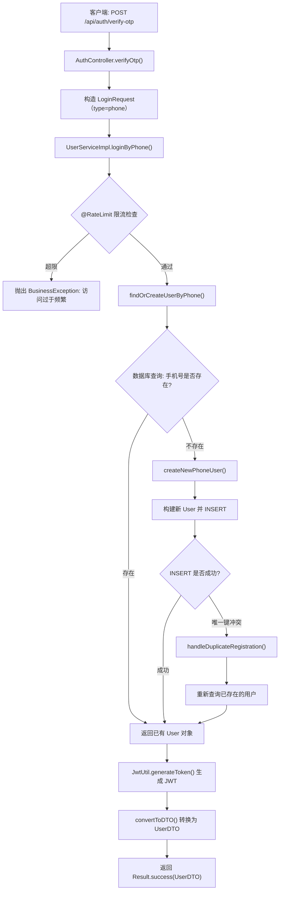

**关键处理逻辑**：

1. **限流保护**：使用 `@RateLimit(count=5, time=1, limitType=IP)` 注解，同一 IP 每秒最多 5 次请求
2. **并发注册幂等性**：当多个请求同时为同一手机号创建账户时，数据库的唯一索引会阻止重复插入。代码捕获 `Duplicate entry` 异常后重新查询已有用户，保证最终一致性
3. **Token 生成**：使用 HMAC-SHA256 算法签名，过期时间从配置 `app.jwt.expiration`（秒）读取，默认 86400 秒（24 小时）

---

### 1.2 微信登录流程

**入口**：`AuthController.wechatLogin()` → `UserServiceImpl.loginByWechat()`

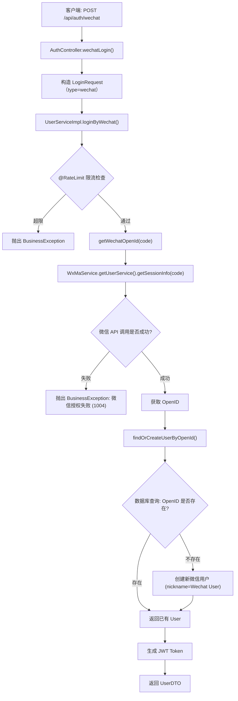

**关键处理逻辑**：

1. **微信 SDK 集成**：使用 `wx-java-miniapp` SDK (`WxMaService`) 调用微信服务器，通过小程序的 `jscode2session` 接口换取 `openId`
2. **新用户创建**：微信首次登录自动创建用户，默认昵称为 `"Wechat User"`

---

### 1.3 首次使用引导（Onboarding）

**入口**：`AuthController.onboarding()` → `UserServiceImpl.onboarding()`

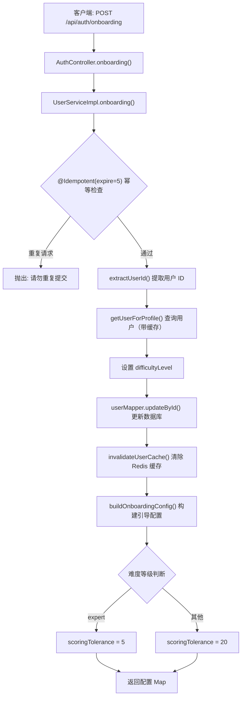

**返回值说明**：
- `scoringTolerance`：评分容差度，专家模式更严格（5），其他模式更宽松（20）
- `recommendedPlan`：推荐训练计划，当前固定返回 `"plan_starter"`

---

### 1.4 用户信息缓存策略 (Cache-Aside)

**实现类**：`UserServiceImpl` 私有方法组

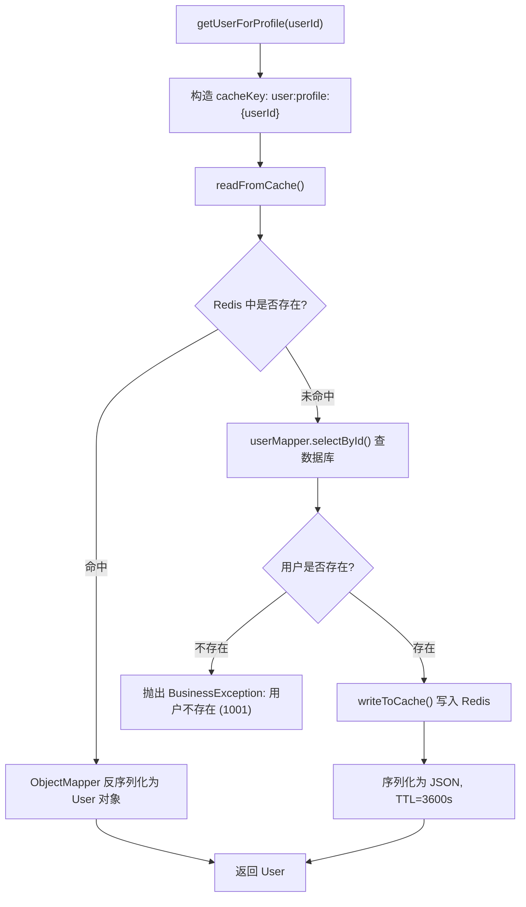

**缓存键格式**：`user:profile:{userId}`  
**过期时间**：3600 秒（1 小时）  
**失效触发**：用户数据更新（如 onboarding）时主动调用 `invalidateUserCache()` 删除对应 Key

---

## 2. 内容库模块 (`fitness-content`)

### 2.1 动作库查询流程

**入口**：`LibraryController.getLibrary()` → `LibraryServiceImpl.getLibrary()`

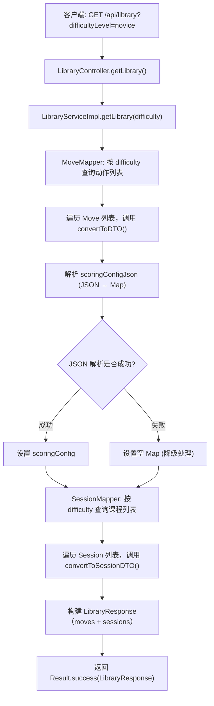

**关键处理逻辑**：

1. **难度过滤**：使用 MyBatis-Plus 的 `LambdaQueryWrapper` 对 `difficulty` 字段进行精确匹配过滤
2. **JSON 配置解析**：动作的 `scoringConfigJson` 在数据库中以 JSON 字符串存储，查询时通过 `ObjectMapper` 反序列化为 `Map<String, Object>`。解析失败时降级返回空 Map，不阻断主流程
3. **课程动作列表**：列表接口中课程的 `moves` 字段返回空列表（`Collections.emptyList()`），需要单独的详情接口填充

### 2.2 个人库收藏流程

**入口**：`LibraryController.addItemToLibrary()` → `LibraryServiceImpl.addItemToLibrary()`

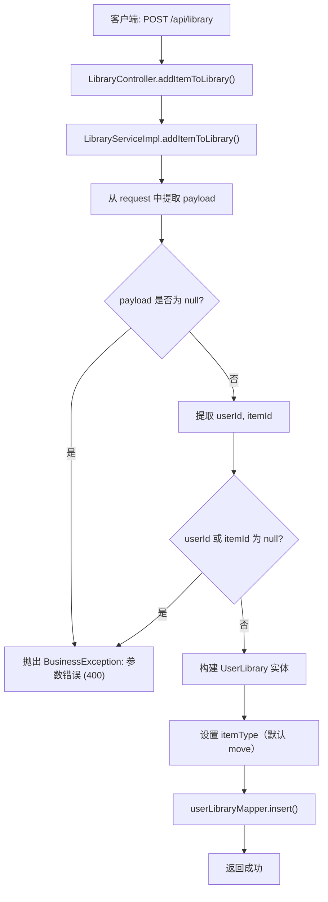

---

## 3. AI 评分模块 (`fitness-ai`)

### 3.1 动作评分核心流程

**入口**：`ScoringController.score()` → `UserScoringServiceImpl.calculateScore()`

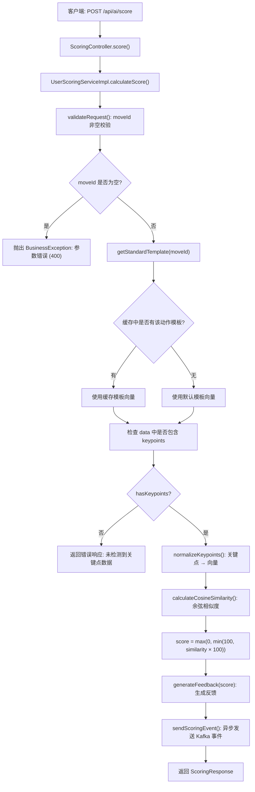

### 3.2 余弦相似度算法

**实现方法**：`UserScoringServiceImpl.calculateCosineSimilarity()`

```
算法公式：
similarity = (A · B) / (|A| × |B|)

其中：
- A = 标准动作模板向量 (34 维: 17 关键点 × 2 坐标)
- B = 用户上传的关键点向量
- A · B = 向量点积（dot product）
- |A|, |B| = 向量的欧几里得范数（L2 norm）
```

**向量构造规则** (`normalizeKeypoints()`)：
1. 从 `keypoints` 数组中提取每个关键点的 `(x, y)` 坐标
2. 展平为一维向量：`[x1, y1, x2, y2, ..., x17, y17]`
3. 最多处理 17 个关键点（COCO 标准），超出部分忽略
4. 坐标值为归一化浮点数（0.0 ~ 1.0）

**评分转换**：`score = Math.max(0, Math.min(100, (int)(similarity * 100)))`

### 3.3 反馈生成规则

**实现方法**：`UserScoringServiceImpl.generateFeedback()`

| 分数区间    | 反馈内容                                  |
| :---------- | :---------------------------------------- |
| `score < 60`  | `"动作幅度不够，请尝试下蹲更深一点"`       |
| `60 ≤ score < 80` | `"动作基本标准，注意保持背部挺直"`     |
| `score ≥ 80`  | `"完美！保持这个节奏"`                     |

### 3.4 评分事件异步发送

**生产者**：`UserScoringServiceImpl.sendScoringEvent()`

1. 从请求数据中提取 `userId`（缺省为 `"unknown"`）
2. 构建 `ScoringResultEvent` 对象
3. 通过 `KafkaTemplate.send()` 发送到 Topic `frontend_event_stream`
4. 使用 `moveId` 作为 Kafka 消息的 Key（保证同一动作的消息落入同一分区，便于消费者聚合）
5. **异常处理**：Kafka 发送失败仅记录日志，不影响主流程返回（非关键路径）

---

## 4. 数据采集模块 (`fitness-data`)

### 4.1 数据采集管道（生产者）

**入口**：`DataCollectionController.collect()`

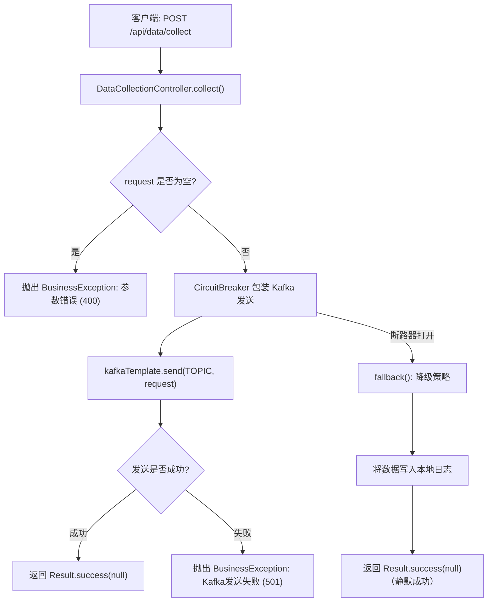

**Circuit Breaker 降级策略**：
- 当 Kafka 服务不可用时，断路器自动切换到降级方法
- 降级方法将请求数据记录到本地日志，防止数据完全丢失
- 返回成功响应以避免前端触发重试风暴

### 4.2 数据消费者处理流程

**入口**：`DataCollectionConsumer.consume()`

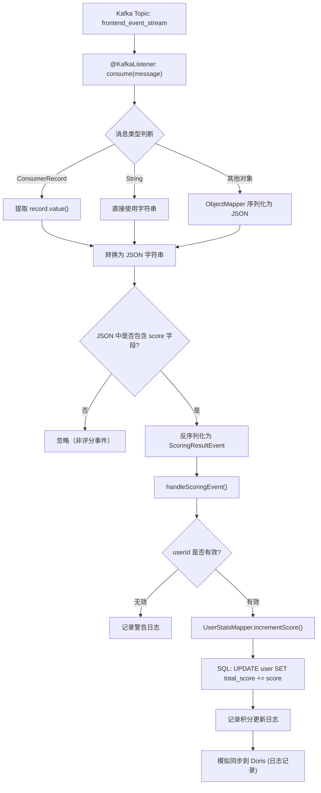

**消费者处理要点**：
1. **多类型消息兼容**：消费者可处理 `ConsumerRecord`、`String` 和普通对象三种消息格式
2. **事件类型过滤**：通过检查 JSON 中是否包含 `"score"` 字段判断是否为评分事件
3. **MySQL 更新**：使用 `UserStatsMapper.incrementScore()` 原子性地累加用户分数
4. **Doris 同步**：当前为模拟实现（仅日志记录），生产环境需对接 Doris 实时写入

---

## 5. 支付模块 (`fitness-pay`)

### 5.1 会员凭证校验

**入口**：`PaymentController.verifyReceipt()`

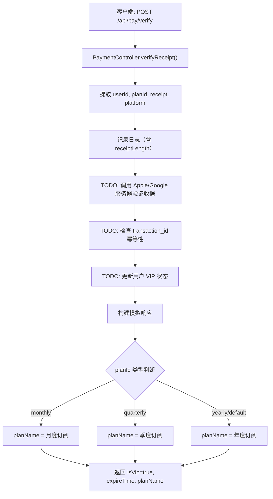

> **注意**：当前实现为模拟版本。生产环境需实现以下关键逻辑：
> 1. 调用 Apple App Store / Google Play 服务器验证 IAP 收据
> 2. 校验 `transaction_id` 是否已处理（防重复充值）
> 3. 将 VIP 状态和过期时间持久化到用户表

---

## 6. 横切关注点 (Cross-Cutting Concerns)

### 6.1 JWT 登录拦截器

**实现类**：`LoginInterceptor` (`HandlerInterceptor`)  
**注册配置**：`WebConfig.addInterceptors()`

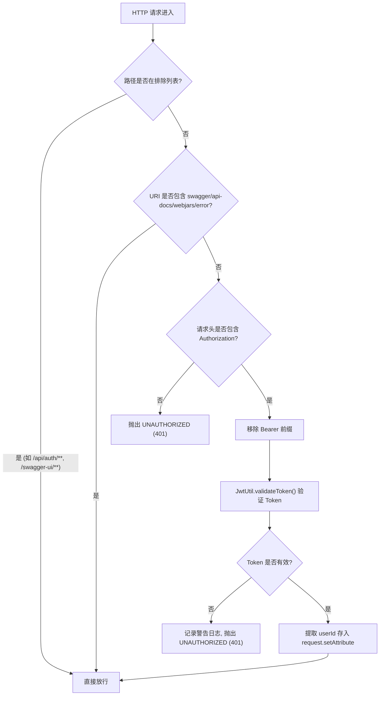

**排除路径列表**：
| 路径模式                | 说明                     |
| :---------------------- | :----------------------- |
| `/api/auth/**`          | 登录、注册接口无需认证    |
| `/swagger-ui.html`      | Swagger UI 入口           |
| `/swagger-ui/**`        | Swagger UI 静态资源       |
| `/v3/api-docs/**`       | OpenAPI JSON 定义         |
| `/webjars/**`           | WebJars 资源              |
| `/actuator/**`          | Spring Boot 监控端点      |
| `/error`                | 错误页面                  |
| `/favicon.ico`          | 站点图标                  |

---

### 6.2 幂等性切面 (Redis SETNX)

**实现类**：`IdempotentAspect`  
**触发注解**：`@Idempotent`

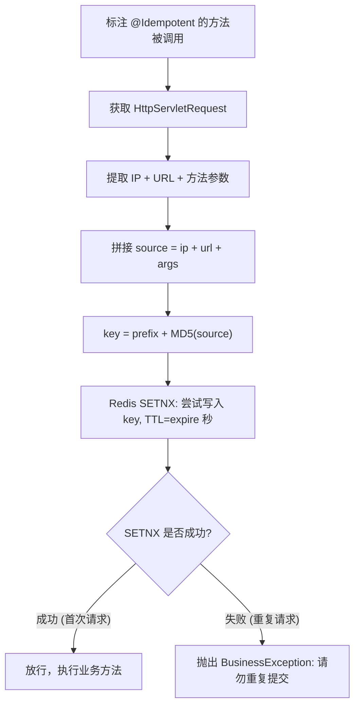

**使用示例**：
```java
@Idempotent(expire = 5)  // 5 秒内相同请求视为重复
public Map<String, Object> onboarding(Map<String, Object> request) { ... }
```

---

### 6.3 接口限流切面 (Redis + Lua 脚本)

**实现类**：`RateLimitAspect`  
**触发注解**：`@RateLimit`

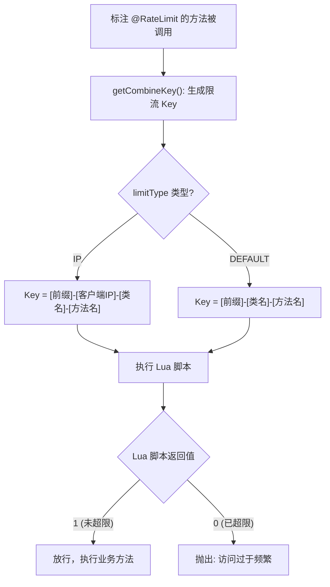

**Lua 脚本逻辑**：
```lua
-- KEYS[1] = 限流 Key
-- ARGV[1] = 时间窗口（秒）
-- ARGV[2] = 最大允许次数
if redis.call('get', KEYS[1]) == false then
    redis.call('set', KEYS[1], 1)
    redis.call('expire', KEYS[1], ARGV[1])
    return 1                                    -- 首次请求，初始化计数器
elseif tonumber(redis.call('get', KEYS[1])) < tonumber(ARGV[2]) then
    redis.call('incr', KEYS[1])
    return 1                                    -- 未超限，递增计数器
else
    return 0                                    -- 已超限，拒绝请求
end
```

**IP 获取优先级**：`X-Forwarded-For` → `Proxy-Client-IP` → `WL-Proxy-Client-IP` → `request.getRemoteAddr()`

---

### 6.4 AES 敏感字段加解密

**实现类**：`EncryptTypeHandler` (MyBatis `BaseTypeHandler`)  
**配置初始化**：`EncryptionConfig` (在 Spring 容器启动后读取 `app.encrypt.key` 并初始化)

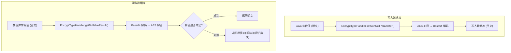

**使用方式**：在实体类字段上通过 MyBatis-Plus 注解指定 TypeHandler：
```java
@TableField(typeHandler = EncryptTypeHandler.class)
private String phone;  // 手机号 (AES 加密存储)
```

**密钥配置**：
- 配置项：`app.encrypt.key`
- Fallback：`"fitness-demo-key"`（仅限开发环境）
- 加密算法：AES-128/192/256（取决于密钥长度）
- 工具库：Hutool `SecureUtil.aes()`

---

### 6.5 全局异常处理

**实现类**：`GlobalExceptionHandler` (`@RestControllerAdvice`)

| 异常类型                               | 处理方式                                | 返回码 |
| :------------------------------------- | :-------------------------------------- | :----- |
| `BusinessException`                    | 提取 `code` + `message`，返回对应错误码  | 自定义 |
| `MethodArgumentNotValidException`      | 提取首个字段错误信息，返回参数错误       | `400`  |
| `Exception`（其他未知异常）             | 记录错误堆栈，返回系统内部错误           | `500`  |

---

## 附: 模块间协作关系总览

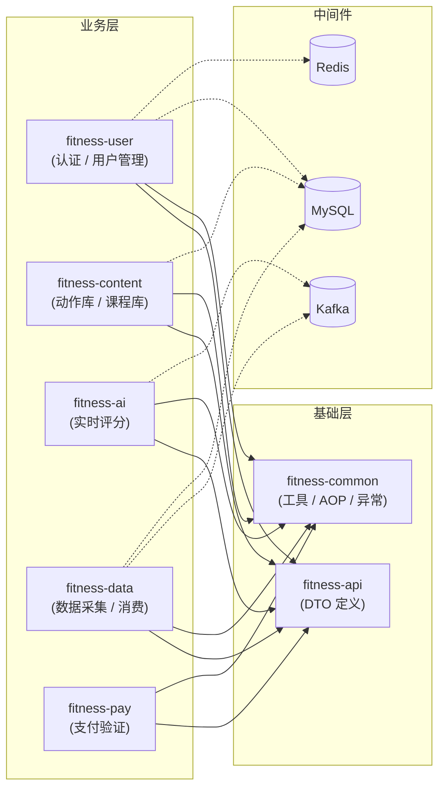
