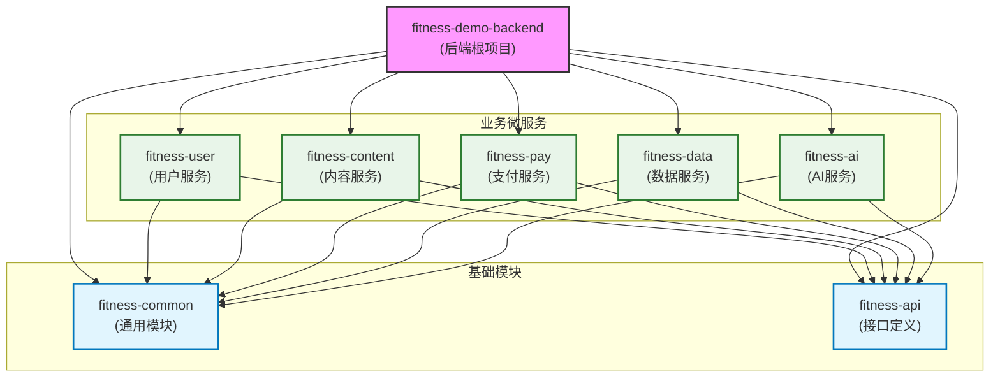
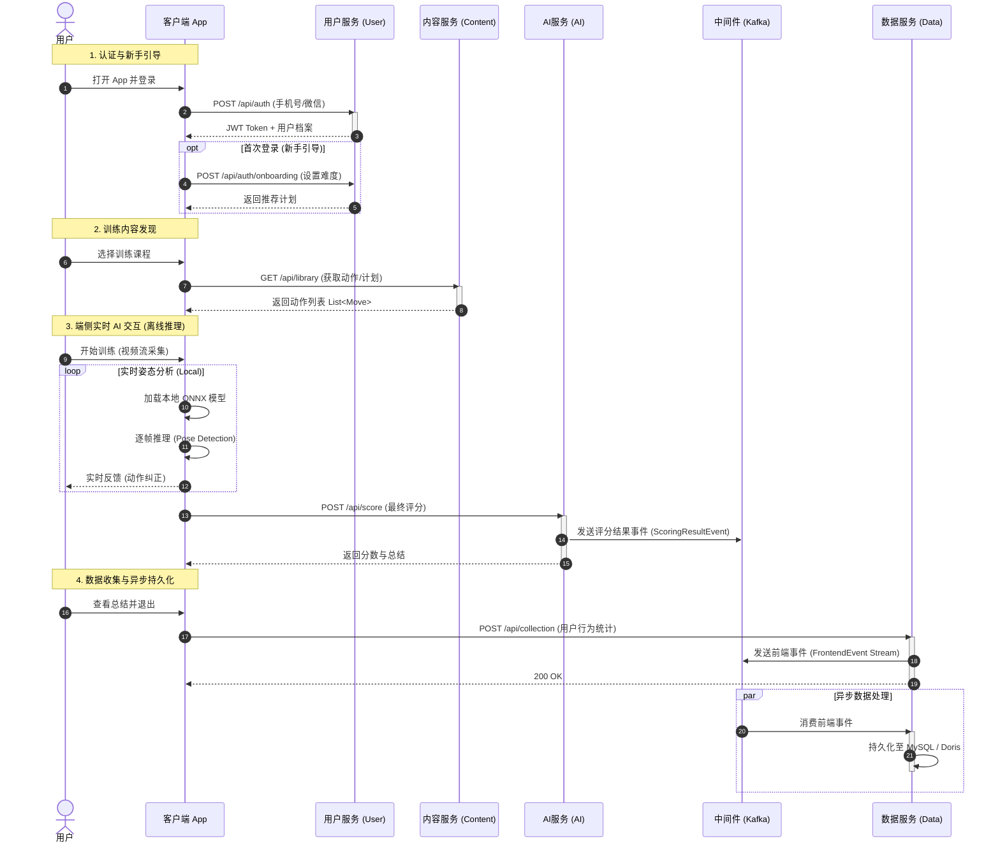

# 项目架构图表

## 1. 项目依赖关系图 (模块结构)
此图展示了 Maven 模块的层级结构与依赖关系。`fitness-common` 和 `fitness-api` 是所有功能微服务的基础层。

```mermaid
graph TD
    %% 样式定义
    classDef root fill:#f9f,stroke:#333,stroke-width:2px;
    classDef base fill:#e1f5fe,stroke:#0277bd,stroke-width:2px;
    classDef service fill:#e8f5e9,stroke:#2e7d32,stroke-width:2px;

    %% 节点
    root["fitness-demo-backend<br/>(后端根项目)"]:::root
    
    subgraph 基础模块
        common["fitness-common<br/>(通用模块)"]:::base
        api["fitness-api<br/>(接口定义)"]:::base
    end

    subgraph 业务微服务
        user["fitness-user<br/>(用户服务)"]:::service
        content["fitness-content<br/>(内容服务)"]:::service
        pay["fitness-pay<br/>(支付服务)"]:::service
        data["fitness-data<br/>(数据服务)"]:::service
        ai["fitness-ai<br/>(AI服务)"]:::service
    end

    %% 根继承关系
    root --> common
    root --> api
    root --> user
    root --> content
    root --> pay
    root --> data
    root --> ai

    %% 模块依赖关系
    user --> common
    user --> api
    
    content --> common
    content --> api
    
    pay --> common
    pay --> api
    
    data --> common
    data --> api
    
    ai --> common
    ai --> api
```

## 2. 业务流程图 (核心训练闭环)
此时序图展示了用户会话的端到端流程：从登录 -> 内容发现 -> 实时 AI 评分 -> 数据持久化。

```mermaid
sequenceDiagram
    autonumber
    actor User as 用户
    participant App as 客户端 App
    participant UserSvc as 用户服务 (User)
    participant ContentSvc as 内容服务 (Content)
    participant AISvc as AI服务 (AI)
    participant Kafka as 中间件 (Kafka)
    participant DataSvc as 数据服务 (Data)

    %% 1. 认证阶段
    Note over User, App: 1. 认证与新手引导
    User->>App: 打开 App 并登录
    App->>UserSvc: POST /api/auth (手机号/微信)
    activate UserSvc
    UserSvc-->>App: JWT Token + 用户档案
    deactivate UserSvc
    
    opt 首次登录 (新手引导)
        App->>UserSvc: POST /api/auth/onboarding (设置难度)
        UserSvc-->>App: 返回推荐计划
    end

    %% 2. 内容阶段
    Note over User, App: 2. 训练内容发现
    User->>App: 选择训练课程
    App->>ContentSvc: GET /api/library (获取动作/计划)
    activate ContentSvc
    ContentSvc-->>App: 返回动作列表 List<Move>
    deactivate ContentSvc

    %% 3. AI 阶段
    Note over User, App: 3. 端侧实时 AI 交互 (离线推理)
    User->>App: 开始训练 (视频流采集)
    loop 实时姿态分析 (Local)
        App->>App: 加载本地 ONNX 模型
        App->>App: 逐帧推理 (Pose Detection)
        App-->>User: 实时反馈 (动作纠正)
    end
    
    App->>AISvc: POST /api/score (最终评分)
    activate AISvc
    AISvc->>Kafka: 发送评分结果事件 (ScoringResultEvent)
    AISvc-->>App: 返回分数与总结
    deactivate AISvc
    
    %% 4. 数据阶段
    Note over User, App: 4. 数据收集与异步持久化
    User->>App: 查看总结并退出
    App->>DataSvc: POST /api/collection (用户行为统计)
    activate DataSvc
    DataSvc->>Kafka: 发送前端事件 (FrontendEvent Stream)
    DataSvc-->>App: 200 OK
    deactivate DataSvc
    
    par 异步数据处理
        Kafka->>DataSvc: 消费前端事件
        activate DataSvc
        DataSvc->>DataSvc: 持久化至 MySQL / Doris
        deactivate DataSvc
    end
```
